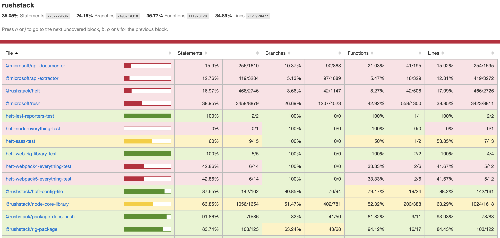

# istanbul-reporter-html-monorepo

An alternate HTML reporter for Istanbul/nyc, intended for multi-project monorepos.

[Istanbul](https://istanbul.js.org/) (and its command-line runner `nyc`) is the code coverage analyzer used by the JavaScript unit test framework [Jest](https://jestjs.io/), and is also commonly added to projects using other unit test frameworks like [Mocha](https://istanbul.js.org/docs/tutorials/mocha/).

The default HTML reporter provided by Istanbul is not ideal when reporting on many projects in a large [monorepo](https://en.wikipedia.org/wiki/Monorepo). The **istanbul-reporter-html-monorepo** plugin solves this problem by creating an HTML report with a single top-level summary, and then separate summary reports for each project inside the monorepo.



## Installation

```console
npm install --save-dev istanbul-reporter-html-monorepo
```

## Usage

In order to produce a satisfactory report, you need to pass information about your project configuration to the reporter. You can do this either by writing this configuration to a JSON file that the reporter can read, or by creating the Reporter from code using the istanbul internals.

### Using a configuration file

To use the reporter with a configuration file, create the file `istanbul-reporter-options.json` in your project folder, like so:

```json
{
    "reportTitle": "Acme Corp",
    "projects": [
        { "name": "@acme/rocket-sled", "path": "vehicles/rocket-sled" },
        { "name": "@acme/jet-engine-core", "path": "libraries/jet-engine-core" }
    ],
    "defaultProjectName": "Other Files"
}
```

Next you'll need to gather the coverage data for your projects. One way to do that would be to loop through your projects and run `nyc merge` for each one.

```console
nyc merge vehicles/rocket-sled/.nyc_output .nyc_output/rocket-sled.json
nyc merge libraries/jet-engine-core/.nyc_output .nyc_output/jet-engine-core.json
```

Finally, you can report using the monorepo reporter, which will use the configuration file you've created.

```console
nyc report -r istanbul-reporter-html-monorepo
```

In larger monorepos, you wouldn't want to create this file by hand -- it's more likely you'll want to generate it on the fly each time from some other source of project data (a list of projects, or a glob pattern, etc.). You can override the path used to find this config file by setting the `ISTANBUL_REPORTER_CONFIG` environment variable.

```console
ISTANBUL_REPORTER_CONFIG=temp/options.json nyc report -r istanbul-reporter-html-monorepo
```

### Using from code

Let's say you have a custom monorepo for `Acme Corp`, containing several subfolders with different projects. You've already run your builds and unit tests and generated JSON file coverage for each project. Here's an example of how you would generate HTML monorepo from these coverage files, using a custom script.

```js
const fs = require('fs);
const { CoverageMap, CoverageMapData, createCoverageMap } = require('istanbul-lib-coverage');
const { Context, ReportBase, createContext } = require('istanbul-lib-report');
const createReport = require('istanbul-reports').create;

async function generateMonorepoReport() {
    const reportTitle = 'Acme Corp';
    const projects = [
        {
            name: '@acme/rocket-sled',
            path: 'vehicles/rocket-sled'
        },
        {
            name: '@acme/jet-engine-core',
            path: 'libraries/jet-engine-core'
        },
        // ... etc.
    ];

    // Build a coverage map containing coverage from all projects
    const coverageMap = createCoverageMap({});
    for (let project of projects) {
        const coverageData = JSON.parse(fs.readFileSync(`${project.path}/coverage/coverage-final.json`));
        coverageMap.merge(coverageData);
    }

    // Specify the output folder for the HTML report (in this case, we'll write to the 'coverage' folder
    // in the root of the monorepo).
    const context = createContext({
      dir: 'coverage',
      coverageMap: coverageMap
    });

    // Create and execute the report, passing in the expected options
    const htmlReport = createReport('istanbul-reporter-html-monorepo', {
        reportTitle: reportTitle,
        projects: projects,
        defaultProjectName: false
    });
    htmlReport.execute(context);
}
```

This example also shows how you can use the istanbul internals directly to combine coverage data, instead of repeatedly calling `nyc merge`, which can offer a speed improvement for larger repos.

## Options

In addition to the list below, the `html-monorepo` reporter accepts all the options that the standard HTML reporter does.

### reportTitle

The `reportTitle` option allows you to specify a custom title for the report, displayed in the upper-left hand corner. If missing or undefined, the default `All files` title is used.

### projects

The `projects` option should contain an array of project definitions. Each project definition consists of a `name` and `path` key. Covered source files within the path specified will be considered part of that project, and will be displayed in the summary underneath the corresponding name.

Consider this project definition:

```js
{ name: 'docs-site', path: 'src/sites/docs' }
```

In the summary listing and breadcrumb links, files under this folder path will be displayed under `docs-site` (the project name), instead of `src/sites/docs` (the project path).

In some cases you may prefer to use the project paths instead of the names, or your users would like to see both the file path and the project name. You can customize the `name` property to achieve your desired result.

```js
// Organize by project, but display only the path
{ name: 'src/sites/docs', path: 'src/sites/docs' }

// Display as name and path
{ name: 'docs-site (src/sites/docs)', path: 'src/sites/docs' }

// Display as path and name
{ name: 'src/sites/docs [docs-site]', path: 'src/sites/docs' }
```

### defaultProjectName

In general, your project list should cover all files that have coverage in your monorepo. If additional files are discovered that don't fall into any of your defined projects, they will be organized under the summary line `Other Files`. You can customize this
default name by providing an alternate string value for `defaultProjectName`.

If you'd rather show these additional source files as "loose" source files in the root of the coverage report, you can disable the default project by specifying `defaultProjectName: false`.

If you want to exclude these files from the report completely, you can use nyc's built-in `--exclude` option in the appropriate project to ensure the files won't get covered. Alternately, you can doctor the combined `coverageMap` in your script and remove
any files you wish to exclude before passing the `coverageMap` to the reporter.

## Examples

See the links below for more detailed examples on how to configure `html-monorepo`.

 * [In a rush monorepo](./examples/rush/README.md)

## Contributing

Additional improvements and bug fixes are welcome!

The guts of the monorepo reporter are located in `index.js`, while the source files in `./lib` are cloned from Istanbul internal packages (`istanbul-lib-report` and `istanbul-reports`). Where possible, keep your changes to `index.js`, to avoid detangling future merge conflicts.

In addition to the basic unit tests available in the `__tests__` folder, the jest configuration for this repo uses the monorepo reporter when reporting its code coverage, so any fatal breaks in the reporter will become apparent just by running `npm test`.

## Disclaimer

This is a community project that provides additional functionality for istanbul/nyc tooling. It is not published by or affiliated with the creators of istanbul/nyc.
