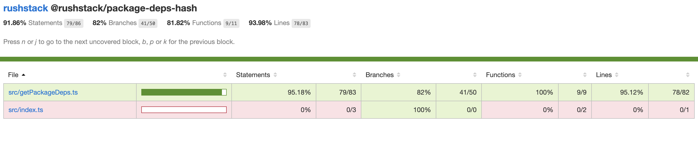

# Using html-monorepo with rush

## Configuration

If you use out-of-the-box defaults (rush build orchestrator with `heft` commands for individual builds), then all you need to do is turn on `collectCoverage` in your jest config for each project.

```js
{
  "preset": "./node_modules/@rushstack/heft/includes/jest-shared.config.json",
  "collectCoverage": true
}
```

By default, heft already outputs coverage in JSON format to `temp/coverage-final.json` in each project folder. In order to collect this into a single report in your repo, you'll want to:

1. Create a new project in your repo, such as `tools/collect-code-coverage`.
2. Write a script to loop through all the projects in `rush.json`, combine their coverage maps, and write the combined HTML report. Here's an [example implementation](./collect-code-coverage.ts) written in TypeScript.
3. Add the dependencies you'll need (for the example implementation, you need `rush-lib`, `istanbul-lib-coverage`, `istanbul-lib-report`, `istanbul-reports`, and of course, `istanbul-reporter-html-monorepo`).
4. Build the project, and run it from your CI pipeline, with a command like `node tools/collect-code-coverage/lib/collect-code-coverage.js`.

## Example Output

These screenshots were generated by enabling code coverage for the [rushstack monorepo](https://github.com/microsoft/rushstack) itself, then running the example script provided above.

Each project in the monorepo is listed as a top-level entry, and after clicking into a project, each source file is listed relative to that project root (with the name of the project in the breadcrumb header).




